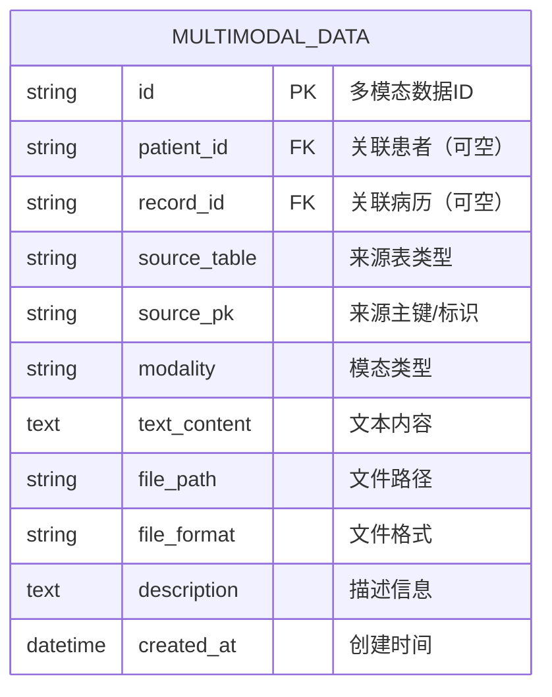

# BACKEND_API_MULTIMODAL.md

---

## 1. 模块概览

- **文件路径**：`app/api/multimodal.py`  
- **蓝图名称**：`multimodal_bp`  
- **依赖模块**：
  - `flask`：`Blueprint`, `request`, `jsonify`, `send_file`
  - `werkzeug.utils.secure_filename`
  - `app.utils.db.get_db_connection`
  - Python 标准库 `os`, `logging`

- **职责**：
  1. 提供多模态数据（医学影像、音频、视频、文档、基因数据等）的统一管理接口；
  2. 维护数据库中 `MULTIMODAL_DATA` 表的记录；
  3. 与物理文件目录 `uploaded_files/` 建立关联，支持按 ID 返回对应文件内容。

- **上传根目录配置**：

  ```python
  UPLOAD_ROOT = os.path.join(os.getcwd(), "uploaded_files")
  os.makedirs(UPLOAD_ROOT, exist_ok=True)
  ```

  也就是说，后端会在当前工作目录下创建 / 使用：  

  ```
  <项目根目录>/uploaded_files/
  ```

---

## 2. 数据模型设计：`MULTIMODAL_DATA` 表

根据 `DATABASE_DESIGN.md` 中的 E-R 图和说明，`MULTIMODAL_DATA` 的结构如下：



### 2.1 字段说明

| 字段名        | 类型       | 约束     | 说明 |
|---------------|------------|----------|------|
| `id`          | VARCHAR    | PK       | 多模态数据唯一标识，例如 `"ct_image_1"`、`"audio_consult_1"` |
| `patient_id`  | VARCHAR    | FK → PATIENTS.id，允许 NULL | 该数据关联的患者 ID（如仅与某个病历关联，可为空） |
| `record_id`   | VARCHAR    | FK → MEDICAL_RECORDS.id，允许 NULL | 该数据关联的病历 ID（如 CT 图像对应某次就诊） |
| `source_table`| VARCHAR    |          | 来源业务表或逻辑分类，如 `"Document"`, `"MedicalImage"`, `"GenomicData"` 等 |
| `source_pk`   | VARCHAR    |          | 来源数据在原表中的主键 / 业务标识，例如 `"AdmissionRecord1"` |
| `modality`    | VARCHAR    |          | 模态类型，例如 `image`, `audio`, `video`, `pdf`, `text`, `timeseries` 等 |
| `text_content`| TEXT       |          | 可选文本内容（如 OCR 结果、报告正文等），对于非文本文件可以为空 |
| `file_path`   | VARCHAR    |          | 文件在服务器本地的相对路径，如 `uploaded_files/medicaldata/MedicalImage/CTImage1.jpg` |
| `file_format` | VARCHAR    |          | 文件格式或扩展名，例如 `jpg`, `png`, `mp3`, `mp4`, `pdf`, `fasta`, `csv` |
| `description` | TEXT       |          | 对该多模态数据的描述，如“入院记录 PDF 示例”“手术流程视频示例” |
| `created_at`  | DATETIME   | 默认当前时间 | 记录创建时间 |

### 2.2 模态与文件示例

- **文档类 Document / DeviceData**
  - PDF：`uploaded_files/medicaldata/Document/AdmissionRecord1.pdf`
  - PDF：`uploaded_files/medicaldata/DeviceData/DataContent1.pdf`
- **影像类 MedicalImage / GenomicData**
  - CT 图：`uploaded_files/medicaldata/MedicalImage/CTImage1.jpg`
  - 基因分析图：`uploaded_files/medicaldata/GenomicData/AnalysisResult1.jpeg`
- **音频类 AudioRecord**
  - `uploaded_files/medicaldata/AudioRecord/心理咨询录音.mp3`
- **视频类 StandardVideo**
  - `uploaded_files/medicaldata/StandardVideo/手术流程视频.mp4`
  - `uploaded_files/medicaldata/StandardVideo/护理操作标准视频.mp4`
- **基因序列 / 时间序列等**
  - `"text"` 模态：如 `GeneSequence1.fasta`
  - `"timeseries"` / `csv`：病人血压 / 血糖 / 体温 CSV

---

## 3. 文件存储约定

### 3.1 物理目录

后端约定以 `UPLOAD_ROOT = <项目根>/uploaded_files` 为根目录，实际结构参考提供的：

```bash
uploaded_files/
├─medicaldata
│  ├─AudioRecord
│  ├─DeviceData
│  ├─Document
│  ├─GenomicData
│  ├─MedicalImage
│  ├─MedicalRecord
│  └─StandardVideo
├─patient_blood_pressure
├─patient_blood_sugar
└─patient_temperature
```

### 3.2 file_path 字段

- `file_path` 一般保存**相对路径/逻辑路径**，例如：
  - `"uploaded_files/medicaldata/MedicalImage/CTImage1.jpg"`
  - `"uploaded_files/medicaldata/StandardVideo/手术流程视频.mp4"`
- `multimodal.py` 中在返回文件时会将其拼接为绝对路径 `abs_path`：

  ```python
  abs_path = os.path.join(os.getcwd(), file_path)  # 实际逻辑大致如此
  return send_file(abs_path, as_attachment=False)
  ```


---

## 4. 多模态 API 列表

根据 `API_DOCUMENTATION.md`，本模块对外提供如下接口：

| 文件名           | 接口路径                            | HTTP 方法 | 描述                       |
|------------------|--------------------------------------|-----------|----------------------------|
| `multimodal.py`  | `/api/multimodal`                   | `GET`     | 获取多模态数据列表         |
| `multimodal.py`  | `/api/multimodal`                   | `POST`    | 创建多模态数据             |
| `multimodal.py`  | `/api/multimodal/<string:data_id>`  | `DELETE`  | 删除多模态数据             |
| `multimodal.py`  | `/api/multimodal/file/<string:data_id>` | `GET` | 按 ID 获取具体文件内容     |


## 5. 接口设计详解

---

### 5.1 获取多模态数据列表

- **URL**：`GET /api/multimodal`
- **功能**：分页 & 条件查询多模态数据记录，用于前端展示和筛选。

#### 5.1.1 响应示例

```json
{
  "success": true,
  "data": {
    "items": [
      {
        "id": "ct_image_1",
        "patientId": "P001",
        "recordId": "R001",
        "sourceTable": "MedicalImage",
        "sourcePk": "CTImage1",
        "modality": "image",
        "filePath": "uploaded_files/medicaldata/MedicalImage/CTImage1.jpg",
        "fileFormat": "jpg",
        "description": "CT 图像示例",
        "createdAt": "2025-12-01T10:23:45"
      }
    ],
    "page": 1,
    "pageSize": 20,
    "total": 1
  }
}
```

#### 5.1.2 错误响应

- 数据库异常 / 其他异常：

```json
{
  "success": false,
  "message": "Error fetching multimodal data"
}
```

---

### 5.2 创建多模态数据记录

- **URL**：`POST /api/multimodal`
- **功能**：创建一条新的多模态数据记录，并将上传文件保存到 `uploaded_files` 目录下。

#### 5.2.1 请求方式
**表单 + 文件上传**
   - `Content-Type: multipart/form-data`
   - 字段包括：`file`（二进制）、`patientId`、`recordId`、`modality` 等
   - 使用 `secure_filename(file.filename)` 生成安全文件名，写入磁盘。

#### 5.2.2 请求字段

- **在 multipart/form-data 中**：

| 字段名       | 类型   | 是否必填 | 说明 |
|-------------|--------|----------|------|
| `file`      | file   | 是       | 上传的文件（二进制） |
| `patientId` | string | 否       | 关联患者 ID |
| `recordId`  | string | 否       | 关联病历 ID |
| `sourceTable` | string | 否     | 来源表类型，如 `"MedicalImage"` |
| `sourcePk`  | string | 否       | 来源记录标识 |
| `modality`  | string | 是       | 模态类型，如 `image`, `audio`, `video`, `pdf`, `text` |
| `description` | string | 否     | 描述信息 |
| `textContent` | string | 否     | 文本内容 |

#### 5.2.3 成功响应示例

```json
{
  "success": true,
  "data": {
    "id": "auto_generated_or_client_provided_id",
    "filePath": "uploaded_files/medicaldata/MedicalImage/CTImage1.jpg"
  }
}
```

#### 5.2.4 失败场景

- 未上传文件 / 参数不完整 → `400`
- 数据库存储失败 / 文件写入失败 → `500`

---

### 5.3 删除多模态数据

- **URL**：`DELETE /api/multimodal/<string:data_id>`
- **功能**：删除指定 ID 的多模态数据记录，并（可选）删除对应的物理文件。

#### 5.3.1 设计要点

1. 通过 `data_id` 查询 `MULTIMODAL_DATA` 中的记录；
2. 记录存在：
   - 可选择同时删除磁盘上的物理文件（基于 `file_path` 和 `UPLOAD_ROOT` 拼接）；
   - 删除表中记录；
3. 记录不存在：返回 404 或业务错误信息。

#### 5.3.2 响应示例

- 成功：

```json
{
  "success": true,
  "message": "Multimodal data deleted"
}
```

- 记录不存在：

```json
{
  "success": false,
  "message": "Multimodal data not found"
}
```

- 内部错误：

```json
{
  "success": false,
  "message": "Internal server error"
}
```

---

### 5.4 获取多模态文件内容

- **URL**：`GET /api/multimodal/file/<string:data_id>`
- **功能**：按 `MULTIMODAL_DATA.id` 从数据库查到 `file_path`，再从磁盘读取文件，通过 `send_file` 返回给客户端。

#### 5.4.1 处理流程

伪代码示意：

```python
@multimodal_bp.route('/api/multimodal/file/<string:data_id>', methods=['GET'])
def get_multimodal_file(data_id):
    conn = None
    cursor = None
    try:
        conn = get_db_connection()
        cursor = conn.cursor(dictionary=True)

        # 1. 根据 data_id 查询 MULTIMODAL_DATA
        cursor.execute(
            "SELECT file_path, file_format FROM multimodal_data WHERE id = %s",
            (data_id,)
        )
        row = cursor.fetchone()
        if not row:
            return jsonify({"success": False, "message": "Data not found"}), 404

        file_path = row["file_path"]
        abs_path = os.path.join(os.getcwd(), file_path)

        if not os.path.exists(abs_path):
            return jsonify({"success": False, "message": "File not found"}), 404

        # 2. 返回文件内容
        return send_file(abs_path, as_attachment=False)

    except Exception as e:
        logger.error("Error fetching file for multimodal %s: %s", data_id, str(e))
        return jsonify({"success": False, "message": str(e)}), 500

    finally:
        if cursor:
            cursor.close()
        if conn:
            conn.close()
        logger.info("Database connection closed for multimodal file fetch.")
```


#### 5.4.2 返回内容类型

- `send_file` 会根据文件扩展名自动推断 `Content-Type`（或通过 `mimetype` 参数指定）：
  - `.jpg` / `.jpeg` → `image/jpeg`
  - `.png` → `image/png`
  - `.mp3` → `audio/mpeg`
  - `.mp4` → `video/mp4`
  - `.pdf` → `application/pdf`
  - `.fasta` → `text/plain` 或自定义 `chemical/seq-na-fasta`

- `as_attachment=False`：浏览器可直接预览（如图片、PDF、视频），而不是强制下载。

---

## 6. 异常处理与日志

- 在 `multimodal.py` 中使用：

  ```python
  logger = logging.getLogger(__name__)
  ```

- 在文件获取接口里已经体现了完整的 try/except/finally 模式：

  - `except`：  
    - 记录错误日志 `logger.error("Error fetching file for multimodal %s: %s", data_id, str(e))`  
    - 返回 `500` + 错误信息；
  - `finally`：  
    - 关闭 `cursor`、`conn`；  
    - 打一条 info 日志表明连接已关闭。

- 建议对 `POST` / `DELETE` 接口也使用相同模式，保证：
  - 数据库连接一定被关闭；
  - 出错信息可追踪。

---

## 7. 与其他模块的关系

- **与数据库初始化脚本**：
  - `insert_data_python/insert_multimodal.py` 会向 `MULTIMODAL_DATA` 插入示例数据，与 `uploaded_files/medicaldata/*` 的文件路径一一对应。

- **与上传目录**：
  - `UPLOAD_ROOT = <项目根>/uploaded_files`
  - 所有多模态文件应统一存放在该目录及其子目录中。

- **与患者 / 病历模块**：
  - 通过 `patient_id`、`record_id` 字段与 `PATIENTS` / `MEDICAL_RECORDS` 关联；
  - 前端通过患者或病历详情页面调用 `/api/multimodal` 和 `/api/multimodal/file/<id>` 展示对应图像/音视频/文档。

---
