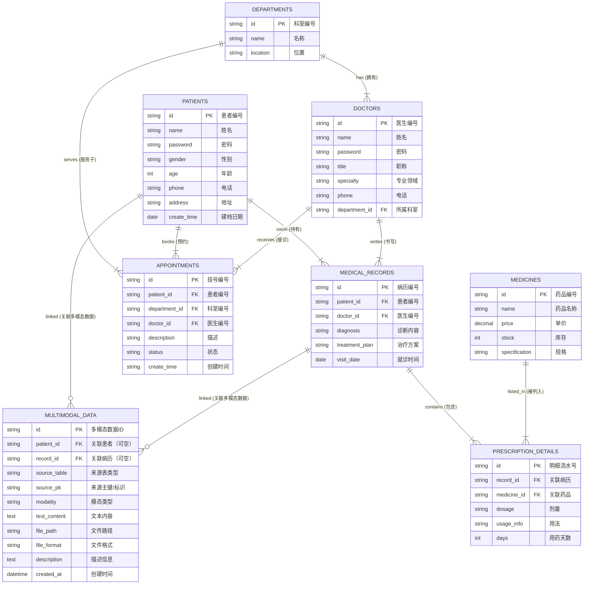

# 数据库设计文档：E-R 模型与范式分析

**项目名称**: MedData Hub 医疗数据管理系统  
**数据库名**: `meddata_hub`

---

## 1. 实体-关系图 (E-R Diagram)

本系统采用 Chen 氏 E-R 模型设计的变体（Crow's Foot 记法），主要包含以下实体及其关系：

*   **核心实体**: 科室 (Departments), 医生 (Doctors), 患者 (Patients), 药品 (Medicines)
*   **业务实体**: 挂号 (Appointments), 病历 (Medical_Records)
*   **关联实体**: 处方明细 (Prescription_Details) - *用于解决病历与药品之间的多对多关系*
*   **扩展实体**: 多模态数据 (Multimodal_Data) - *用于统一管理医学影像、音频、视频、PDF 文档等多模态文件及文本内容*
### 1.1 可视化 E-R 图

### 1.2 实体关系文字说明

1.  **科室 - 医生 (1:N)**: 一个科室有多名医生，一名医生归属一个科室。
2.  **患者 - 挂号 (1:N)**: 一个患者可以有多次挂号记录。
3.  **医生 - 挂号 (1:N)**: 一名医生处理多个挂号申请。
4.  **患者 - 病历 (1:N)**: 一个患者拥有多份历史病历。
5.  **病历 - 药品 (M:N)**: 
    *   一份病历可以包含多种药品。
    *   一种药品可以出现在多份病历中。
    *   实现方式: 通过 `prescription_details` 中间表拆解为两个 1:N 关系。
6.  **患者/病历 - 多模态数据 (1:N )**:
    *   一个患者可关联多条多模态数据记录（如影像、音频、视频、报告等）。
    *   一份病历也可关联多个多模态数据项，用于补充诊疗过程相关材料。
    *   multimodal_data.patient_id 与 multimodal_data.record_id 均为可选外键，以支持仅按患者维度或仅按病历维度管理文件的业务需求。
---

## 2. 数据库范式分析 (Normalization Analysis)

本数据库设计严格遵循关系数据库设计规范，所有表结构均通过 **第三范式 (3NF)** 检验，旨在减少数据冗余，保证数据一致性。

### 2.1 第一范式 (1NF) 检验
*   **定义**: 强调属性的原子性，即表中字段不可再分。
*   **分析**: 
    *   所有表（`patients`, `doctors`, `medicines` 等）的字段如 `name`, `phone`, `price` 均为单一原子值。
    *   不存在重复组或数组类型的字段。
*   **结论**: ✅ **符合 1NF**。

### 2.2 第二范式 (2NF) 检验
*   **定义**: 在满足 1NF 的基础上，消除非主属性对主键的**部分函数依赖**（主要针对联合主键）。
*   **分析**: 
    *   本系统所有表均采用 **单一主键 (Single Primary Key)** 设计（均为 `id` 字段）。
    *   由于不存在联合主键，非主属性（如 `name`, `age`）自然完全依赖于唯一的 `id` 主键，不可能存在部分依赖。
*   **结论**: ✅ **符合 2NF**。

### 2.3 第三范式 (3NF) 检验
*   **定义**: 在满足 2NF 的基础上，消除非主属性对主键的**传递函数依赖**。即：属性不应依赖于其他非主属性。

#### 逐表详细分析：

1.  **`departments` 表**
    *   依赖关系: `id` (PK) $\to$ `name`, `location`
    *   分析: 科室名称和位置直接依赖于科室ID，不存在传递依赖。
    *   **结论**: ✅ 符合 3NF。

2.  **`doctors` 表**
    *   依赖关系: `id` (PK) $\to$ `name`, `title`, `phone`, `department_id`
    *   分析: 所有个人信息直接依赖于医生工号。`department_id` 作为外键引用科室表，未存储科室名称，消除了冗余。
    *   **结论**: ✅ 符合 3NF。

3.  **`patients` 表**
    *   依赖关系: `id` (PK) $\to$ `name`, `gender`, `age`, `phone`, `address`
    *   分析: 患者信息直接依赖于患者ID。
    *   **结论**: ✅ 符合 3NF。

4.  **`medical_records` 表**
    *   依赖关系: `id` (PK) $\to$ `patient_id`, `doctor_id`, `diagnosis`, `treatment_plan`
    *   分析: 诊断和治疗方案是基于单次就诊（即 `id`）产生的，直接依赖于主键。
    *   **结论**: ✅ 符合 3NF。

5.  **`appointments` 表 (特殊说明)**
    *   **字段**: `id`, `patient_id`, `doctor_id`, `department_id`, `status`...
    *   **潜在争议**: 理论上存在传递依赖 `doctor_id` $\to$ `department_id` (因为医生属于特定科室)。
    *   **设计辩护**: 
        *   历史快照：医生可能会换科室。如果只存 doctor_id，一年后查询去年的挂号记录，可能会因为医生换了科室而导致显示错误的科室信息。在挂号表中存入当时的科室 ID 是为了保留“历史事实”。
        *   业务逻辑：有些医院允许先挂“科室号”（不指定医生），此时 doctor_id 可能为空，必须依赖 department_id。  
    *   **结论**: ✅ 符合 3NF (基于历史快照业务逻辑)。

6.  **`medicines` 表**
    *   依赖关系:`id` (PK) $\to$ `name`, `price`, `stock`, `specification`
    *   分析:
        *   药品名称、单价、库存、规格均由主键 id 唯一决定，字段之间不存在函数依赖或传递依赖。
        *   与处方明细的关系通过外键维护，未引入冗余。
    *   **结论**:✅ 符合 3NF。

7.  **`prescription_details` 表**
    *   依赖关系:`id` (PK) $\to$ `record_id`, `medicine_id`, `dosage`, `usage_info`, `days`
    *   分析:
        *   每条处方明细以独立主键记录，不使用联合主键，因此不存在部分依赖。
        *   所有字段均依赖于 id 本身，且未存储药品名称、单价等冗余信息，避免了典型传递依赖。
    *   **结论**:✅ 符合 3NF (结构正确拆解了病历与药品的多对多关系)。

8.  **`multimodal_data` 表**
    *   依赖关系:`id` (PK) $\to$ `patient_id`, `record_id`, `source_table`, `source_pk`,`modality`, `text_content`, `file_path`, `file_format`, `description`, `created_at`
    *   分析:
        *   所有字段直接依赖于主键 id，不存在部分依赖。
        *   patient_id 与 record_id 均为可选外键，允许：
             *   仅关联患者（如生命体征文件、长期监测数据）
             *   仅关联病历（如一次就诊的影像、报告）
        *   虽然某些情况下存在 record_id → patient_id，但系统设计明确允许非绑定关系，因此二者并存属于**业务层面的合理建模**，不构成违反 3NF 的冗余问题。
        *   文件信息字段（如 file_path, file_format）为多模态数据固有特征，不依赖其他属性。
    *   **结论**:✅ 符合 3NF（结构兼顾范式要求与多模态文件管理的灵活性）。
### 2.4 总结

经分析，`meddata_hub` 数据库的所有表结构设计合理：
1.  所有属性均为原子值。
2.  每个表都有独立的唯一主键。
3.  非主键字段直接依赖于主键，通过外键（Foreign Key）建立表间联系，消除了数据冗余和传递依赖。

该设计满足第三范式要求，能够有效支持系统的增删改查及事务处理。
